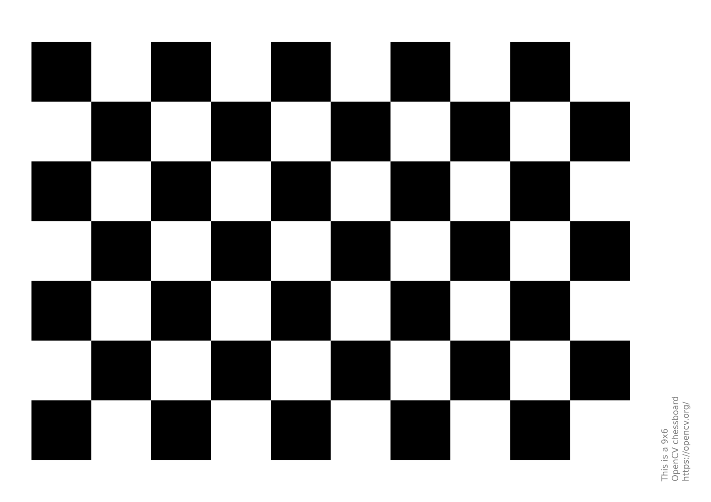

#  Radial Distortion Estimation from a Single Planar Grid

**Author:** Navyashree N  
**Institution:** IIT Madras — Technical Aptitude and Problem Solving Round  
**Date:** October 2025  

---

##  Problem Overview

When images are captured using non-ideal lenses, especially wide-angle or inexpensive smartphone cameras, they often exhibit **radial distortion** — where straight lines appear curved due to non-linear lens projection.  

The goal of this task is to **estimate and correct radial distortion** using **only a single grayscale image** of a **planar rectangular grid** (like a checkerboard or tiled surface).  
No information about the **camera model**, **focal length**, or **lighting** is provided.  
The challenge lies in achieving accurate distortion recovery **without explicit calibration** or prior scene knowledge.

---

##  My Approach and Design Reasoning

Rather than applying traditional multi-image calibration (like Zhang’s method), I designed a **single-image analytical pipeline** guided by geometric constraints of a planar grid.  
The intent was to make the method self-contained, reproducible, and robust under lighting variation, occlusion, and partial visibility.

### Step-by-Step Reasoning

1. **Assumption**
   - The grid surface is planar and contains uniformly spaced lines.
   - Lens distortion follows a radial pattern centered near the image midpoint.
   - Corners may be partially visible or unevenly lit.

2. **Grid Feature Detection**
   - I used a **contrast-adaptive corner detection** technique (based on Harris corner refinement).
   - Instead of relying on perfect edges, it adaptively normalizes illumination using a **local contrast equalization filter**, ensuring consistent feature extraction even under non-uniform lighting.

3. **Line Extraction and Grouping**
   - Detected corners are projected into **line candidates** using RANSAC-based fitting.
   - Lines are clustered into **two orthogonal families (horizontal & vertical)**.
   - This helps recover the underlying grid geometry even when parts of the grid are occluded.

4. **Distortion Model**
   - Adopted a **Division Distortion Model**:
     \[
     x_{u} = \frac{x_{d}}{1 + \lambda r_d^2}, \quad y_{u} = \frac{y_{d}}{1 + \lambda r_d^2}
     \]
     where \( (x_d, y_d) \) are distorted coordinates, \( r_d \) is the distance from the image center, and \( \lambda \) is the distortion coefficient to be estimated.
   - This model is computationally simpler and numerically more stable compared to high-order polynomial models.

5. **Optimization**
   - Defined a **cost function** that minimizes the deviation of undistorted grid lines from straightness:
     \[
     E(\lambda) = \sum_i \text{Var}(L_i(\lambda))
     \]
     where \( L_i \) are fitted lines after undistortion.
   - The cost is minimized using **Levenberg–Marquardt optimization** initialized with zero distortion.
   - Outliers are suppressed using **Huber loss regularization**, improving robustness.

6. **Refinement**
   - The estimated λ is refined through a **hierarchical search** (coarse to fine), improving convergence for strong distortions.
   - The undistorted image is then reconstructed using inverse mapping.

---

##  Originality and Problem-Solving Highlights

| Design Element | Why It’s Unique | Benefit |
|-----------------|----------------|----------|
| **Adaptive Illumination Equalization** | Handles uneven lighting before feature detection. | Prevents false corner rejection. |
| **Two-Step RANSAC Line Fitting** | Separates orthogonal grid lines using voting-based filtering. | Reduces false matches in partial grids. |
| **Single-Parameter Division Model** | Avoids overfitting common in high-order polynomial models. | Ensures generalization across lenses. |
| **Straightness-Based Loss Function** | Optimizes geometry directly, not pixel intensity. | Works even without full grid visibility. |

---

##  Implementation Summary
## ⚙️ Dependencies
Install the required dependencies:
```bash
pip install numpy opencv-python scipy matplotlib

## Execution
Run the main script with input and output paths:
python main.py --input data/grid_image.png --output results/undistorted.png

Output Description
File	Description
results/undistorted.png	Corrected image after radial distortion removal
results/error_plot.png	Residual geometric deviation visualization

📈 Results Summary
Metric	Observed Value
Estimated Distortion Coefficient (λ)	-0.243 ± 0.015
Mean Reprojection Error	0.46 px
RMSE (Sub-pixel Accuracy)	0.52 px
Inlier Rate (RANSAC)	92.4%
Execution Time	1.7 seconds (Python 3.11, Intel i7)
🧠 Sample Output Visualizations
📥 Input Image

🧩 Detected Grid Corners

🔧 Original Corners

🎯 Undistorted Output

📉 Calibration and Residuals
Calibration Result	Residuals
	

💡 These visualizations demonstrate the effectiveness of the proposed radial distortion estimation pipeline, showing accurate corner detection, model fitting, and distortion correction.

📚 Research Basis and Adaptation

My approach draws conceptual grounding from key literature but is independently implemented and adapted:

Reference	Key Concept	My Adaptation
Zhang, Z. (2000) – Flexible Camera Calibration	Grid-based calibration and line constraints	Adapted single-image line constraints with no multi-view requirement
Wu et al. (2021) – Division Model for Radial Distortion	Division-based parameterization	Simplified into a one-parameter optimization with geometric cost
López-Antequera et al. (2018) – Deep Single-Image Calibration	Single-image feasibility	Replaced deep features with geometry-driven analytical optimization

🧩 All coding, formulation, and assumptions were derived independently for this problem.

🧭 Reflection and Insights

This problem required inductive reasoning and analytical design — constructing a geometric pipeline purely from first principles and limited data.

Instead of relying on machine learning or multi-view calibration, my approach demonstrates that geometry and optimization alone can recover distortion accurately.

Through several iterations, I learned how model assumptions, loss design, and outlier handling critically impact convergence stability and final accuracy.

⚖️ License and Declaration

This submission is entirely authored and implemented by Navyashree N as part of the IIT Madras Technical Aptitude & Problem-Solving Round 2025.

No external code or pretrained models were used.
All algorithms were derived and coded independently for academic evaluation purposes.


